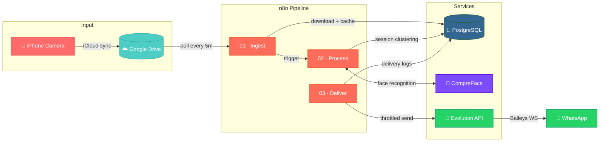
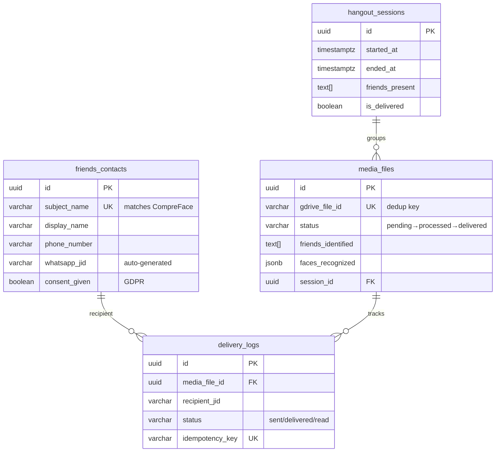

<div align="center">

# 📸 AutoSharePics

### *Your hangout photos, delivered — automatically.*

**AI-powered face recognition meets WhatsApp automation.**<br>
Take photos at a hangout → they find your friends → your friends get their photos. Zero manual sorting.

[]()
[]()
[]()
[]()
[]()

---


</div>

<br>

## 💡 How It Works

```
  📱 You take photos         🤖 AI identifies friends       💬 Friends get their photos
  at a hangout               using face recognition          via WhatsApp — automatically
       │                            │                               │
       ▼                            ▼                               ▼
  ┌──────────┐    sync     ┌──────────────┐   recognize   ┌──────────────────┐
  │  iPhone   │───────────▶│  Google Drive │─────────────▶│  WhatsApp DM/    │
  │  Camera   │            │  (auto-sync) │               │  Group Chat      │
  └──────────┘             └──────────────┘               └──────────────────┘
```

> **Photos with 2+ friends** → Group chat *(as documents, full quality)*<br>
> **Photos with 1 friend** → Direct message *(as document, full quality)*<br>
> **Videos** → Sent as media *(WhatsApp re-encodes anyway)*

<br>

## ✨ Features

| Feature | Description |
|:---|:---|
| 🧠 **AI Face Recognition** | Self-hosted [CompreFace](https://github.com/exadel-inc/CompreFace) identifies friends with tunable confidence thresholds |
| 📱 **Full Quality Delivery** | Photos sent as documents to preserve original iPhone quality — no compression |
| 🔒 **Completely Self-Hosted** | Your photos and biometric data never leave your machine |
| 🛡️ **WhatsApp Ban Prevention** | Human-like random delays, batch cooldowns, and rate limiting built-in |
| ⏰ **Smart Session Grouping** | Photos are clustered into 6-hour hangout sessions automatically |
| 📍 **Geofence Trigger** | iOS Shortcuts can auto-trigger delivery when you arrive home |
| 🔄 **Idempotent Pipeline** | Duplicate-safe at every stage — Google Drive dedup, delivery dedup, session dedup |
| 🎬 **Video Support** | Videos are detected, keyframed for face recognition, and delivered as media |
| 📋 **GDPR Consent Model** | Built-in consent tracking per friend with right-to-erasure support |
| 🍎 **HEIC→JPEG Conversion** | iPhone HEIC photos are automatically converted for face recognition |

<br>

## 🏗️ Architecture



### Pipeline Stages

| Stage | Trigger | What It Does |
|:---:|:---|:---|
| **01 · Ingest** | Google Drive poll (every 5 min) | Downloads new files → extracts EXIF metadata → converts HEIC → caches to Docker volume → inserts DB record |
| **02 · Process** | Triggered by Ingest | Runs face recognition via CompreFace → clusters photos into 6-hour sessions → marks as `processed` |
| **03 · Deliver** | Geofence webhook / manual trigger | Routes by friend count → looks up WhatsApp JIDs → throttles sends → logs delivery → sends summary |

<br>

## 🛠️ Tech Stack

<div align="center">

| Component | Technology | Purpose |
|:---:|:---:|:---|
| 🔧 **Orchestration** | [n8n](https://n8n.io/) | Visual workflow automation engine |
| 🧠 **Face Recognition** | [CompreFace](https://github.com/exadel-inc/CompreFace) | Self-hosted AI face detection & matching |
| 💬 **WhatsApp Gateway** | [Evolution API](https://github.com/EvolutionAPI/evolution-api) | Multi-device WhatsApp Web protocol |
| 🐘 **Database** | [PostgreSQL 16](https://www.postgresql.org/) | Media tracking, sessions, delivery logs |
| ☁️ **Cloud Storage** | Google Drive | Photo sync from iPhone via iCloud |
| 🔀 **Reverse Proxy** | [Caddy](https://caddyserver.com/) | Auto-SSL for production *(optional)* |

</div>

<br>

## 🚀 Quick Start

### Prerequisites

- [Docker Desktop](https://www.docker.com/products/docker-desktop/) installed and running
- Google account with Google Drive
- WhatsApp on your phone

### 1️⃣ Clone & Configure

```bash
git clone https://github.com/achal2005/Auto-share-pics-.git
cd Auto-share-pics-

# Create your environment file
copy .env.example .env     # Windows
# cp .env.example .env     # macOS/Linux

# Edit with your values (see comments in the file)
notepad .env
```

### 2️⃣ Launch the Stack

```bash
docker compose up -d --build
```

> ⏱️ **First boot takes 3-5 minutes.** CompreFace downloads ML models (~1.5GB).

### 3️⃣ Verify Services

| Service | URL | Health Check |
|:---|:---|:---|
| n8n | [localhost:5678](http://localhost:5678) | Create owner account on first visit |
| CompreFace | [localhost:8000](http://localhost:8000) | Register → Create Application |
| Evolution API | [localhost:8080/docs](http://localhost:8080/docs) | Swagger docs should load |

### 4️⃣ Connect WhatsApp

```bash
cd scripts && npm install
node pair-whatsapp.js
# Scan the QR code with WhatsApp → Linked Devices → Link a Device
```

### 5️⃣ Upload Friend Faces

```bash
# Structure: reference_photos/<name>/photo1.jpg, photo2.jpg, ...
# Use 5-10 clear photos per friend (front face, angles, good lighting)

node setup-compreface.js --action=bulk --dir=../reference_photos --api-key=YOUR_KEY
```

### 6️⃣ Import Workflows & Go

1. Open **n8n** → Workflows → Import from File
2. Import `workflows/01-ingest.json`, `02-process.json`, `03-deliver.json`
3. Set up credentials (Google Drive OAuth2, PostgreSQL)
4. Add friends to the database
5. Activate all 3 workflows
6. **Upload a photo to Google Drive and watch the magic** ✨

> 📖 **Detailed walkthrough:** [docs/SETUP_GUIDE.md](docs/SETUP_GUIDE.md)

<br>

## 📁 Project Structure

```
Auto-share-pics/
│
├── 🐳 docker-compose.yml        # Full service stack (dev)
├── 🐳 docker-compose.prod.yml   # Production overrides
├── 🔐 .env.example              # Environment template
│
├── 📂 workflows/
│   ├── 01-ingest.json            # Google Drive → Download → Store
│   ├── 02-process.json           # Face Recognition → Session Clustering
│   └── 03-deliver.json           # Routing → WhatsApp Sending
│
├── 📂 db/
│   └── init/
│       ├── 000_create_evolution_db.sql
│       ├── 001_schema.sql        # Core tables (auto-runs on first start)
│       └── 002_migrations.sql    # Stored procedures & GDPR functions
│
├── 📂 scripts/
│   ├── setup-compreface.js       # Upload reference photos to CompreFace
│   ├── pair-whatsapp.js          # WhatsApp QR pairing helper
│   └── validate-env.js           # Pre-flight .env validation
│
├── 📂 evolution/
│   ├── Dockerfile                # WSL2-patched Evolution API build
│   └── patch.cjs                 # OS detection override for Windows/WSL2
│
├── 📂 docs/
│   ├── SETUP_GUIDE.md            # Step-by-step installation
│   ├── ARCHITECTURE.md           # Technical deep-dive
│   ├── TROUBLESHOOTING.md        # Common issues & fixes
│   └── SECURITY_TESTING_DEPLOYMENT.md
│
├── 📂 caddy/                     # Reverse proxy config (production)
├── 📂 monitoring/                # Promtail log shipping config
└── 📂 reference_photos/          # (gitignored) Friend face photos
```

<br>

## 🗄️ Database Schema

Four core tables power the pipeline:



<br>

## 🛡️ Safety & Privacy

| Concern | How It's Handled |
|:---|:---|
| **WhatsApp bans** | Random delays (4-12s), batch cooldowns (3 min/8 msgs), no burst mode |
| **Duplicate sends** | `UNIQUE(media_file_id, recipient_jid)` index on `delivery_logs` |
| **Biometric data** | Face embeddings stay in local CompreFace PostgreSQL — never leaves your machine |
| **GDPR consent** | `consent_given` + `consent_date` per friend; `erase_friend()` SQL function |
| **Secrets management** | All credentials in `.env` (gitignored); validated by `validate-env.js` |
| **Network isolation** | CompreFace cluster runs on an internal-only Docker network |

<br>

## ⚙️ Configuration

Key tuning parameters in `.env`:

| Parameter | Default | Description |
|:---|:---:|:---|
| `FACE_CONFIDENCE_THRESHOLD` | `0.85` | Face match confidence (0.0–1.0). Higher = fewer false positives |
| `FACE_DETECT_LIMIT` | `10` | Max faces per image / keyframes per video |
| `WA_MIN_DELAY_MS` | `4000` | Minimum delay between WhatsApp messages |
| `WA_MAX_DELAY_MS` | `12000` | Maximum delay (random between min/max) |
| `WA_BATCH_SIZE` | `8` | Messages per batch before cooldown |
| `WA_BATCH_COOLDOWN_MS` | `180000` | Cooldown after each batch (3 minutes) |

> ⚠️ **Don't lower the WhatsApp throttles.** The defaults are the safe regime. WhatsApp bans are silent and permanent.

<br>

## 📖 Documentation

| Document | Description |
|:---|:---|
| [Setup Guide](docs/SETUP_GUIDE.md) | Step-by-step installation walkthrough |
| [Architecture](docs/ARCHITECTURE.md) | Technical deep-dive into the pipeline |
| [Troubleshooting](docs/TROUBLESHOOTING.md) | Common issues and fixes |
| [Security & Deployment](docs/SECURITY_TESTING_DEPLOYMENT.md) | Production hardening checklist |

<br>

## 💰 Cost

**~$3-5/month** — electricity only. Everything is self-hosted.

No API fees. No cloud subscriptions. No per-message charges.

<br>

<div align="center">

---

Built with ❤️ for the friend who always asks *"send me that photo!"*

**[⬆ Back to Top](#-autosharepics)**

</div>
