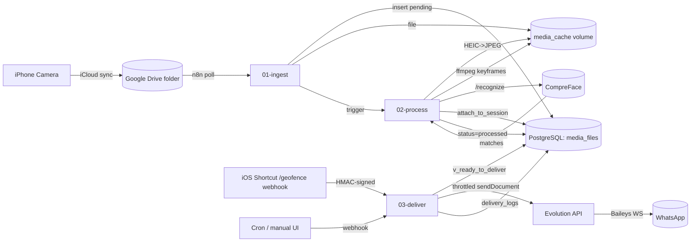

# AutoSharePics — Architecture

## Goal

Take photos shot during a hangout, identify which friends are in them with face recognition, and deliver originals over WhatsApp without manual sorting.

## Data flow



## Stages

### 01-ingest

**Trigger:** Google Drive watch on `GDRIVE_FOLDER_ID`.

**Idempotency:** Insert into `media_files` first; the `gdrive_file_id` UNIQUE constraint absorbs duplicate webhooks. On conflict, the workflow exits without re-downloading.

**Output:** A `media_files` row with `status='pending'`, the file written to `media_cache`, and an explicit Execute-Workflow call into `02-process` (sub-workflow, not HTTP — keeps the call inside n8n's transactional boundary).

### 02-process

**Trigger:** Sub-workflow call from `01-ingest`, *or* a 5-minute cron sweep over `status='pending' AND ingested_at < now() - 30s` for retries after a crash.

**Steps:**

1. `UPDATE media_files SET status='processing', process_attempts = process_attempts + 1`. The status check is the lock — concurrent invocations skip rows already in `processing`.
2. If `mime_type LIKE 'image/heic%'`: convert via `heic-convert`, write to `processed_path`.
3. If `is_video=true`: extract keyframes with `ffmpeg -vf "select='eq(pict_type,I)',scale=1280:-1"` capped at `FACE_DETECT_LIMIT`.
4. POST each frame to CompreFace `/recognize` with `det_prob_threshold=0.8`, `prediction_count=3`.
5. **Confidence-aware filtering** — drop a face match if (a) `top.similarity < FACE_CONFIDENCE_THRESHOLD` *or* (b) `top.similarity - second.similarity < 0.05` (ambiguous).
6. Call `attach_to_session(media_id, taken_at, 6, friends_identified)` (a SQL function added in [002_migrations.sql](../db/init/002_migrations.sql)) — this serializes session-creation under a Postgres advisory lock so two photos arriving in the same window can't create duplicate sessions.
7. `UPDATE status='processed'` and persist face metadata.

### 03-deliver

**Trigger:** Webhook with `X-Hub-Signature-256: sha256=<hmac>` where the HMAC is `HMAC-SHA256(rawBody, GEOFENCE_WEBHOOK_SECRET)`. The first node in the workflow MUST verify this — Webhook nodes accept anything by default.

**Steps:**

1. `SELECT * FROM v_ready_to_deliver` (already filters out anything successfully sent).
2. Lock candidates by inserting a `delivery_logs` row with `status='pending'` and a deterministic `idempotency_key = "{media_id}:{recipient_jid}:{attempt}"`. The unique index on `idempotency_key` is the safety net for parallel runs.
3. **Routing:**
   - `friend_count = 0` → mark `status='skipped'` on the media row, no delivery row.
   - `friend_count = 1` → DM the friend's `whatsapp_jid` (respecting `send_preference`).
   - `friend_count ≥ 2` → group chat (`WHATSAPP_GROUP_JID`); fall back to per-friend DMs if the env var is empty.
4. **Send shape:** photos as `sendDocument` (preserves quality), videos as `sendMedia` (WhatsApp re-encodes either way).
5. **Throttle:** sleep `random(WA_MIN_DELAY_MS, WA_MAX_DELAY_MS)` between sends; after `WA_BATCH_SIZE` sends, sleep `WA_BATCH_COOLDOWN_MS`.
6. On Evolution success, `UPDATE delivery_logs SET status='sent'` — this is when the partial-unique dedup engages.
7. After all recipients for a media are logged successfully, mark `media_files.status='delivered'`.

## Key data invariants

| Invariant | Enforced by |
|---|---|
| Same Google Drive file processed at most once | UNIQUE on `media_files.gdrive_file_id` |
| Same media never sent to same recipient twice | Partial unique on `delivery_logs (media_file_id, recipient_jid) WHERE status IN ('sent','delivered','read')` |
| Failed sends can be retried without index conflict | The above is partial, not blocking |
| Two concurrent ingests can't double-create a session | `attach_to_session()` advisory lock |
| `subject_name` matches between CompreFace and DB | CHECK `subject_name = lower(subject_name)` + setup script lowercases |
| GDPR-erased friend is removed from new media | `erase_friend()` strips `friends_identified` arrays |

## Tunable knobs (defaults are the safe regime)

| Knob | Default | Effect of raising | Effect of lowering |
|---|---|---|---|
| `FACE_CONFIDENCE_THRESHOLD` | 0.88 | Fewer false positives, more "Unknown" | More matches, more wrong-person sends |
| `CF_IMG_LIMIT` | 1024 | Better recall on small faces, slower CompreFace | Faster, misses 5+ person group photos |
| `WA_MIN/MAX_DELAY_MS` | 4000/12000 | Safer (less ban risk), slower | Faster, real ban risk |
| `WA_BATCH_SIZE` | 8 | Bigger bursts before cooldown | More frequent cooldowns |
| Session window | 6h | Fewer, larger sessions | More, smaller sessions |

## Confidence-aware routing

The original threshold-only check is unsafe with small subject sets. The audited `02-process` should implement:

```js
function pickFriend(predictions, threshold = 0.88, ambiguityGap = 0.05) {
  if (!predictions?.length) return null;
  const sorted = [...predictions].sort((a, b) => b.similarity - a.similarity);
  const top = sorted[0];
  if (top.similarity < threshold) return null;
  if (sorted[1] && top.similarity - sorted[1].similarity < ambiguityGap) return null;
  return top.subject;
}
```

This drops the dominant failure mode where two friends with similar facial structure compete and one wins by 0.01.

## Failure modes & recovery

| Failure | Detection | Recovery |
|---|---|---|
| Drive transient 5xx | n8n node retry | Built-in retry with backoff |
| HEIC conversion error | exception in `02-process` | `status='failed'`, `last_error` populated, manual retry via SQL `UPDATE status='pending' WHERE id=...` |
| CompreFace timeout | axios `ECONNABORTED` | Retry with backoff (in `setup-compreface.js`); workflow marks `failed` after 3 attempts |
| WhatsApp 4xx (rate limit) | Evolution returns error | `delivery_logs.retry_count++`, batch backoff doubles |
| Evolution disconnect | Healthcheck fails | Container restart picks up paired session from `evolution_instances` volume |
| Operator wants to "rewind" delivery | manual SQL | `UPDATE delivery_logs SET status='cancelled' WHERE ...` then re-trigger `03-deliver` |
| GDPR right-to-erasure | `SELECT erase_friend('alice')` | Strips face data from media + flags friend |

## Security boundaries

- All backend services live on `compreface_net` (internal only) and `autoshare_net` (bridge). Only n8n, CompreFace UI, and Evolution API expose host ports — and in prod, those bind to `127.0.0.1` only with Caddy fronting.
- Secrets enter via `.env` and are validated by `scripts/validate-env.js` before `docker compose up`.
- The geofence webhook verifies HMAC inside the first workflow node; constant-time comparison.
- CompreFace embeddings are biometric data. The `compreface_postgres_data` volume is the system of record for consent — encrypt host disk and back it up separately.

## Things explicitly NOT in scope

- Multi-tenant. One operator, one social graph.
- Real-time delivery. The 6-hour session window means latency is minutes-to-hours by design.
- Cloud failover. Single-host. Restart container or restore volume.
- Per-message opt-out. The only opt-out granularity is `friends_contacts.send_preference` and `is_active`.
